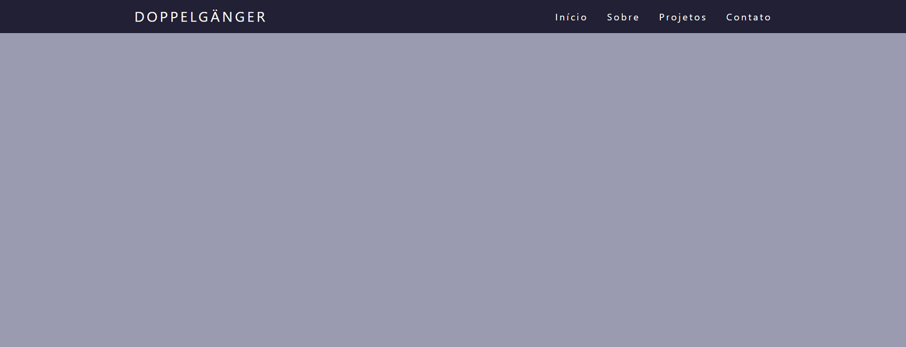
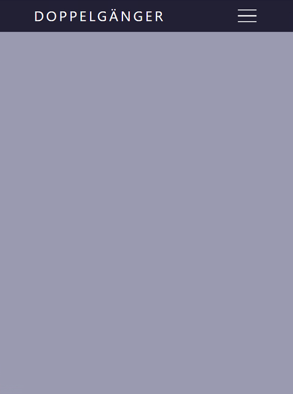
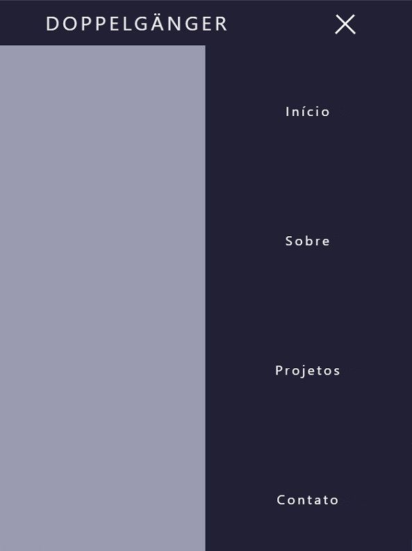

## Descrição

&nbsp;&nbsp;&nbsp;&nbsp;&nbsp;&nbsp;Projeto simples de barra de navegação responsiva.

### Cores e Hexadecimais

* Background NavBar: #222035
* Background Body: #9a9ab0
* Font-color: #fff

Referência: https://www.youtube.com/watch?v=bHRXRYTppHM&ab_channel=TigerCodes

### Exemplos:

